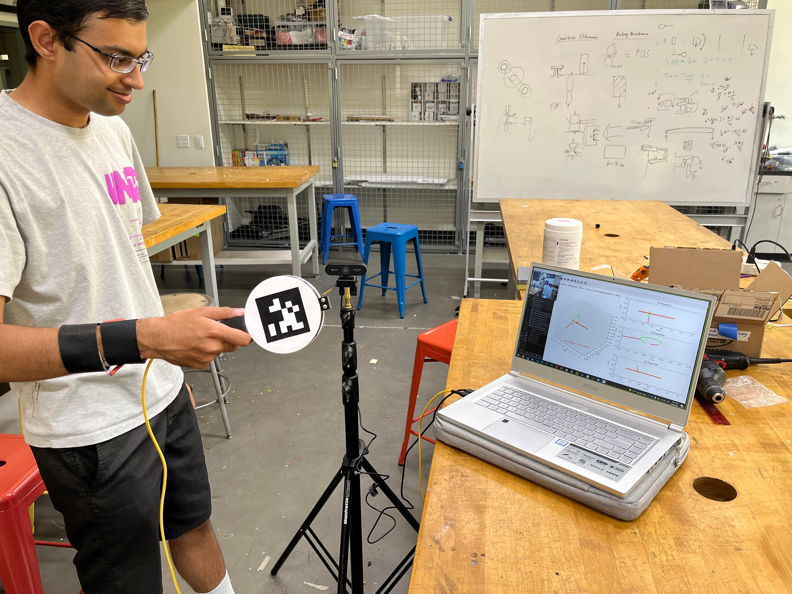
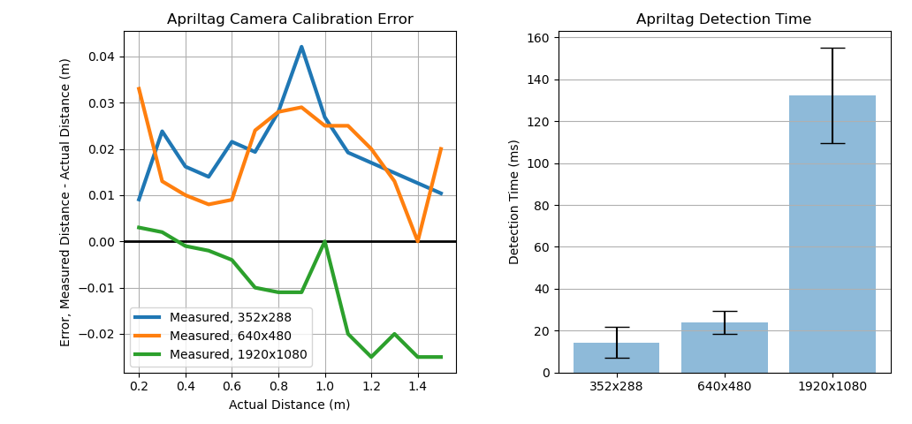
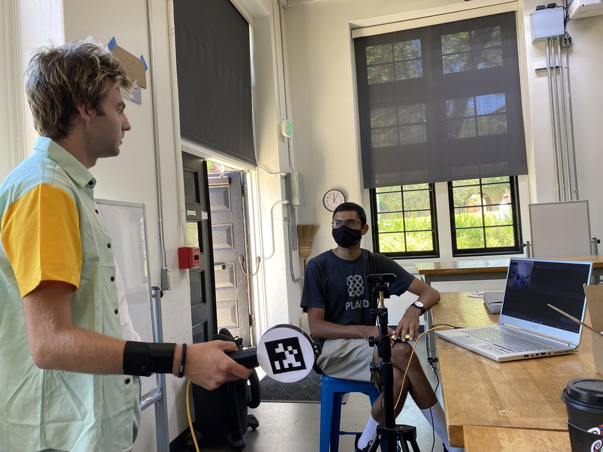
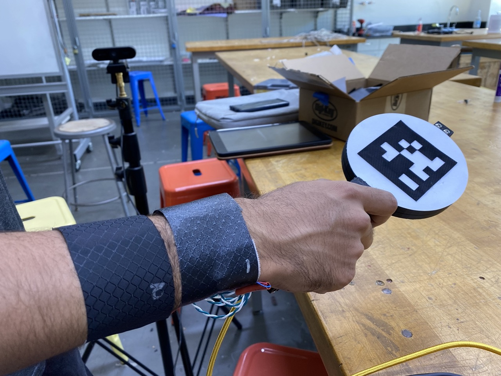
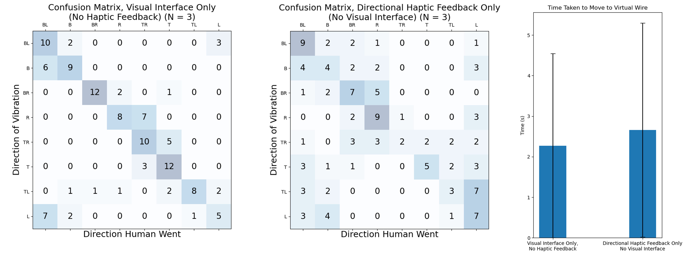
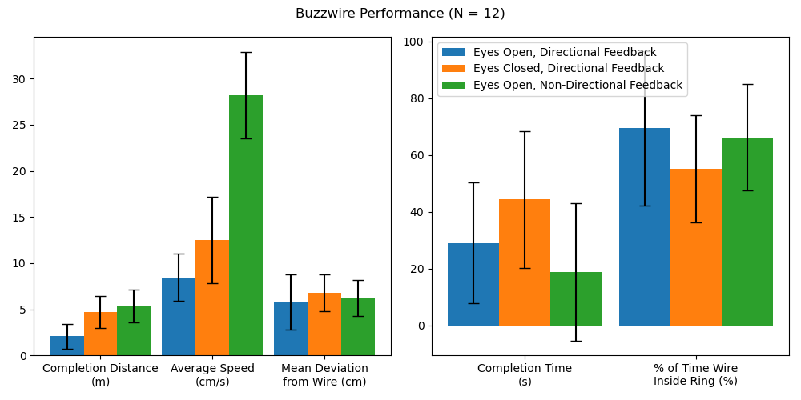
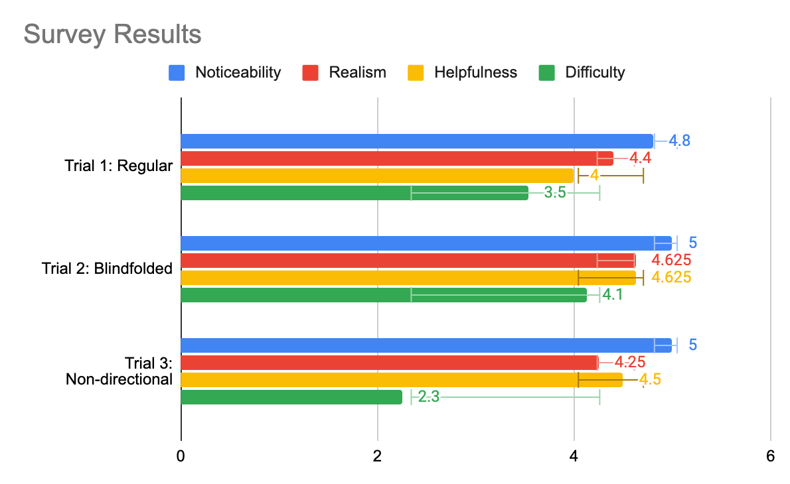

# Directional Vibration Cues for 3D Virtual Tracking
###  ME 327 (Introduction to Haptic Devices & Control), Spring 2022
###  Project team member: Ahad Rauf, Emily Wong, Skylar Baker

Our project investigated how directional vibration feedback can affect tracking performance in a virtual environment. The system is based on the Buzzwire children’s toy, the physical version of which involves threading a loop through a wire, which makes a sound when the loop touches the wire. We built a virtual version of this setup, where users hold a tracked wand and attempt to traverse a virtual “wire.” Although traditional Buzzwire games only use a single vibration feedback when the loop and wire collide, we also added directional haptic cues in a wristband to explore whether directional information can improve positional tracking or even allow non-sighted users to navigate 3D virtual environments. We first explore the dynamics of directional haptic feedback, showing that (N=3) users can distinguish broad directional cues when vibration motors embedded in the wristband are activated. We then had users play the Buzzwire game under three conditions: with both a visual interface and directional haptic feedback, with eyes closed and only directional haptic cues, and with both visual and non-directional haptic cues. We found that users were significantly more steady when following the wire given both visual and directional haptic cues, traversing less than half the distance in free space compared to either of the alternative modes. Moreover, users were able to traverse the wire with their eyes closed and given only directional cues with only a 15% performance cut compared to when given both visual and directional haptic cues, in terms of the mean deviation from the center of the wire, highlighting the promise of this feedback approach for future work towards more immersive and accessible virtual environments.

| |
|:-----:|
|<b>User guiding wand through virtual buzzwire with the help of haptic feedback.</b>  |

## I. Introduction 
Proprioception, or our sense of self-movement and body position based on the sensors in our muscles and tendons, is a challenging problem in complex virtual environments, where our own sense of position might not match with its representation in the virtual space. Many traditional virtual reality (VR) devices include a single vibration motor for haptic feedback, which only enables non-directional haptic cues for scalar metrics such as contact with a surface. These simple interaction modalities provide little more than visual information to the user in challenging hand-eye coordination and dexterity-related tasks, according to prior studies [Momi 2020; Radhakrishnan 2021]. We hypothesize, however, that directional haptic cues, which provide both a scalar magnitude and a directional gradient to guide users towards correcting their positional deviation, can improve human performance and engagement with the virtual task.

We first aim to experimentally characterize the dynamics of how well humans understand and follow directional haptic cues. We then apply our findings by having users wear a wristband providing directional haptic cues while playing a virtual Buzzwire game. The user’s position is tracked to produce vibration feedback as a function of the user’s distance from the wire, enabling closed-loop feedback in this human-in-the-loop dynamical system.

## II. Background
Haptic feedback is a popular addition to VR handheld devices for its ability to supplement traditional visual and auditory cues with tactile cues when navigating virtual environments. In particular, haptic feedback that augments proprioception is particularly interesting for its potential to free up our eyes and ears to virtual tasks instead of focusing on simple navigation. However, traditional integrations of this style of haptic feedback with virtual experiences are often only used to indicate contact with a surface [Christou 2018; Momi 2020; Radhakrishnan 2021] through a single vibration motor, or only designed for large gestures [Strasnick 2017] or 2D motion [Brock 2014; Hong 2017] when using an array of vibration motors distributed spatially around the user's hand or wrist. Compared to prior literature, we hypothesize that directional vibration cues can also be used for relatively precise (<10 cm) motions in 3D to improve the user's ability to navigate tight tolerances, which can then further enhance the realism and engagement of future VR experiences.

We chose the Buzzwire game for its easy-to-understand objective and challenging dexterity problems. The toy has been used in several empirical studies of versatility, particularly in the fields of rehabilitation [Christou 2018; Radhakrishnan 2021], in assessing the precision of human operators in VR [Momi 2020], and in testing motor skills [Shafti 2016]. These previous studies form a strong basis for how we can quantitatively measure user performance in a virtual Buzzwire environment and found strong connections between changes in user's score in the Buzzwire game and their physical dexterity or arousal as a function of time. However, they typically only use a single vibration motor operated at a single PWM input to represent contact with the wire, which one study found provided little to no additional benefit over traditional visual displays that operate continuously [Momi 2020]. Our work differs from prior Buzzwire literature in its exploration of haptic guidance cues as a continuous and directional force, scaling the magnitude as a function of the user's distance from the wire and orienting the vibration's gradient in the direction of contact.

## III. System Design and Implementation
Our system comprises two devices: a visual display showing different 2D and 3D perspectives of the virtual wand and the target "wire," and a pair of stacked wristbands embedded with four equally spaced vibration motors. The vibration motors are connected to a wand, which houses an AR tag for positional tracking. See Figure 1 below for a pictorial depiction of the system. All code, CAD files, and other project resources can be found at https://github.com/ahadrauf/me327_final_project/.

| |
|:-----:|
|<b>Fig. 1: (a) Physical system setup, with the user in the process of guiding a wand while monitoring its progress in the virtual space via a visual interface. (b) A capture of the visual interface, showing both 3D and 2D projections of the wand’s position relative to the wire in space. As shown, the user is currently not on the wire, and needs to move farther up.</b>  |

### III.A. Hardware Design and Implementation
We designed and 3D printed a wand that holds an Arduino Micro and a 10-pin terminal block, which helped simplify wire connections in case a motor failed. The ring on the wand holds an AR tag that is detected by a camera on a tripod a few feet away for localization, as described in the previous section. We laser cut the AR tag from black ballistic nylon, which reflected much less ambient light than the printer ink we used during earlier checkpoints, drastically improving our localization accuracy under variable lighting conditions. The ring has an outer diameter of 117 mm, and the AR tag is 69 mm on each side.

Four of the PWM pins on the Arduino Micro are used to control four coin cell vibration motors, which are taped to a cloth wristband. A 10-ft long cord connects the Arduino to our computer, which communicates over serial to the Arduino with instructions on which motors to actuate. We designed this feedback approach based on prior user studies performed by [Hong 2017] and [Tang 2020], which found, respectively, that 4 motors in the cardinal directions were more interpretable by the user than 8 motors along both the cardinal and ordinal directions, and that the wristbands should be spaced roughly 6-8 cm apart for users to better interpret distinct vibration patterns.

| |
|:-----:|
|<b>Fig. 2: Physical construction of the wand.</b>  |

### III.B. Wand Localization Using AR Tags
In order to localize the wand’s position in 3D space, we used an eMeet Nova wide angle webcam ([Amazon link](https://smile.amazon.com/gp/product/B08DXSG5QR/)) mounted onto a tripod and the popular [AprilTag 3 library](https://github.com/AprilRobotics/apriltag) (with Python bindings written by [Pupil Labs](https://github.com/pupil-labs/apriltags/)). In Figure 3, we compare both the positional accuracy as a function of distance to the camera as well as the average detection time for a 69mm side length AprilTag, and found that decreasing the camera’s video resolution to 640x480px provided a good tradeoff of positional accuracy to detection rate.

In order to ensure accurate positional tracking, we also calibrated the camera’s intrinsic parameters using [this MATLAB script](https://www.mathworks.com/help/vision/ug/camera-calibration-using-apriltag-markers.html) for 640x480px images to have a focal lengths (443.8266, 443.4999), principal points (320.3827, 247.3580), and radial distortion (0.1387, -0.1552) in the x- and y-directions, respectively.

| |
|:-----:|
|<b>Fig. 3: Calibration data of how well the camera can localize a 69mm side length AprilTag for three different input video resolutions. (Left) Positional error along the primary axis as a function of distance to the camera. (Right) Runtime of the detection algorithm.</b>  |

### III.C. Visualization
We generated the visualization using the Python library Matplotlib. Given the AprilTag’s position and rotation matrices obtained in the previous section, we mapped the wand’s position into the camera’s coordinate frame. The ring’s radius was increased by 50% in the virtual space compared to reality, since we found that the task became too difficult given the relative scaling of each axis otherwise.

We divided the ring into 15 equal length line segments, and for every camera frame we found the distance from each line segment’s midpoint to the wire in order to compute the color mapping, shown in Fig. 1(b). Line segments were colored green if they were over 2/3 the ring’s radius away from the ring’s center and yellow otherwise if the wire was still inside the ring. Because [formal algorithms for computing whether a 3D curve is inside a planar ring](https://www.geometrictools.com/Documentation/DistanceToCircle3.pdf) were more computationally expensive than we expected, we approximated this algorithm by simply computing whether the wire was within a sphere of the ring’s radius from the ring’s center point. If the wire was outside the ring, for visual continuity we mapped the ring’s position as if it were right at the edge of the wire instead, changed all yellow line segments to red, and changed the threshold between green and yellow to 1/3 the radius instead of 2/3. As an additional visual cue, the handle was colored green if the wire was inside the ring, and red otherwise.

In hindsight, Matplotlib was not necessarily the best visualization platform due to its slow update rate, decreasing our theoretical 40 fps from the AprilTag detection alone to just 9 fps. Although it was very functional for a preliminary demo, a future implementation would benefit from a visualization library designed for dynamic updating, such as [VPython](https://vpython.org/).

### III.D. Haptic Feedback
We divided the areas of contact into the four cardinal and four ordinal directions, relative to the closest point on the wire to the ring. When the wire is within one of the four ordinal sectors (top left, top right, bottom left, bottom right), one vibration motor turns on opposite to the direction of the quadrant. For instance, if the user was too far in the top left, the bottom right motor would vibrate to signal to the user that the bottom right of the wand was touching the wire. When the wire is within one of the four cardinal sectors (top, left, right, bottom), two motors vibrate in the opposite direction. For example, if the user was too far to the top, the bottom two wires would vibrate to mimic where the "wire" was touching the wand.

Motors were actuated at 80% duty cycle when outside the ring, and at 40% duty cycle when inside the ring to give a light nudge in the right direction. We also found that continuous vibration made it difficult to localize the direction after a few seconds, so we engaged the motors for one second, then turned it off for half a second, and then repeated.

## IV. EXPERIMENT SETUP

### IV.A. Dynamical Characterization of Directional Haptic Cues

We performed two basic experiments to characterize the utility of directional haptic cues. In the first experiment, users (N=3, the study authors) were asked to locate a wire using only visual cues. In the second experiment, users were asked to find the same wire using purely haptic cues. Wires were displaced radially by 20 cm from the camera's center axis, and the user's actual direction was computed as soon as the wand reached a radius of 20 cm - the ring's radius of 5.85 cm = 14.15 cm away from its original point. The user's actual direction was computed by mapping the user's final position relative to their original position to the camera's image plane, and then compared with the actual wire direction to generate a confusion matrix. Each trial was composed of the user relocating to the center wire, hearing a tone to begin navigation, moving until they heard a second tone that they had moved the required distance, and then returning back to the center wire. Both experiments involved 40 localizations, or 5 trials of each of the 8 cardinal and ordinal directions. The visual study can be seen at https://youtu.be/DWKJMVPLxOc, and the physical setup is shown in Figure 4. Results are discussed in Sec. V.4, and formed the basis of our future demonstrations.

| |
|:-----:|
|<b>Fig. 4: Dynamical characterization using only haptic feedback.</b>  |

### IV.B. Buzzwire Game
Applying what we learned through our dynamic characterization on the effectiveness of directional haptic cues, we created a demonstration of its effect through a virtual recreation of the Buzzwire game. We used two adjacent wristbands to attach the vibration motors to the wrist. As shown in Figure 5, the bands were rotated to have the vibration motors along the bone on either side, which correspond to the vertical up and down directions when users hold the wand naturally while facing the camera. The camera is attached to a tripod and placed about a meter away, so that the user can physically move towards it while watching the screen and virtual wire. The overall setup can be seen in Figure 1, and a video of the demonstration in action can be viewed at https://youtu.be/koWOUodvAaY.

| |
|:-----:|
|<b>Fig. 5: Schematic of how the wristband is attached to the user’s wrist, with the vibration motors aligned with the bones on either side.</b>  |

Our demonstration works in several stages:

1. The user is able to familiarize themselves with the virtual environment with a straight-line as their wire. Their data is not recorded.
2. When the user is comfortable with the environment, we toggle a button so the user sees the buzzwire for the real test and is able to get oriented at the start of the wire.
3. Once the user is at the start of the wire, a tone indicates the start of data collection. The user tries to move along the curve as quickly and accurately as possible. Their position is recorded and several performance metrics are displayed after they have finished their run.

If there is additional time during the demonstration, we also encourage users to attempt the course with their eyes closed, relying purely on the vibrational motors to guide their path. We also had additional modes for non-directional feedback, mimicking the original Buzzwire game which only had a single vibration motor, as well as a colorblind red-orange-blue color scheme to replace the standard red-yellow-green color scheme, but we didn’t get a chance to try these during demo day.

In total, we collected data from N = 20 individuals on the standard experiment, including 9 individuals who tested the blindfolded mode as well. We also were able to invite 15 of those participants to take a short survey on their experience using the device. We modeled the survey after Assignment 5’s peer review survey, asking participants four questions: “noticeability of haptics,” “realism of haptics,” “helpfulness of haptics,” and “difficulty of task.” Each question was rated using a 5-point Likert scale, with 5 representing the most and 1 the least.

## V. RESULTS
### V.A. Dynamical Characterization of Directional Haptic Cues
As shown in Figure 6, visual feedback was much more reliable in terms of how well users could distinguish directions, with a 61.7% accuracy rate as opposed to the purely haptic feedback's 38.3% accuracy rate. However, in both cases we can see that the majority of the confusion arose from directions next to each other, which we judged as sufficient for users to figure out the roughly desired direction of motion in a complex virtual environment. We also noted that the response time to both visual and haptic feedback were very similar, which we interpreted to mean that both stimuli could synergistically work to guide the user in the right direction.

| |
|:-----:|
|<b>Fig. 6: (Left) Confusion matrix when users were presented with a purely visual interface and no haptic feedback. (Middle) Confusion matrix when users were guided using purely haptic feedback with no visual interface. (Right) The average time taken by users to navigate to the wire under each condition.</b>  |

### V.B. Impact of Directional Haptic Feedback on Buzzwire Performance
Inspired by [Christou 2018], we measured 5 quantitative metrics to assess user performance while navigating the spline curve:

1. The time taken to complete each wire. Timing began as soon as the ring passed an invisible collision detector at one end of the wire and stopped in a similar fashion at the other end of the wire.
2. The percentage of time the user spent with the wire inside the ring.
3. The mean deviation from the exact center of the ring and the spline representing the wire.
4. The total distance traversed by the ring from beginning to end of the trial. This would match the wire length exactly if no deviations were made
5. The average speed from beginning to end of each wire.

Results are shown in Figure 7, where we compared performance metrics between the 12 participants who conducted both the standard and blindfolded experimentst, and the 4 participants who conducted both the standard and non-directional haptic feedback experiments. As shown, when participants had their eyes closed, they performed worse than with the visual interface, but they were still able to complete the task with reasonable performance and confidence. We found that users were significantly more steady when following the wire given both visual and directional haptic cues, traversing less than half the distance in free space compared to either of the alternative modes. Moreover, users were able to traverse the wire with their eyes closed and given only directional cues with only a 15% performance cut compared to when given both visual and directional haptic cues, in terms of the mean deviation from the center of the wire.

We attributed the participants' increase in speed and decrease in completion time during the blindfolded and non-directional haptic feedback cases to the fact that we tested those cases after the directional haptic feedback case due to demo day limitations, rather than to a statistically meaningful conclusion. This meant that users completing the blindfolded and non-directional tests had more experience in the environment, which may have positively impacted their ability to move through the wire.

| |
|:-----:|
|<b>Fig. 7: Comparison of Buzzwire performance metrics between the 12 participants who conducted both the standard and blindfolded experiment, and the 4 participants who conducted both the standard and non-directional haptic feedback experiments. Error bars represent one standard deviation.</b>  |

### V.C. Qualitative Feedback
Figure 8 shows the results of our survey (N = 15). We found that participants generally found the directional haptics useful and noticeable, and that the task was a sufficiently challenging demonstration of dexterity and hand-eye coordination. 80% of participants (N = 15) rated the directional haptic feedback as useful when paired with the visual display, and 100% of the participants who tried playing with their eyes closed and relying solely on directional haptic cues (N = 8) found the feedback helpful. We also noted an interesting trend that people who tried non-directional haptic feedback (N = 4) tended to rate the task easier than with directional haptic feedback, which we investigated through qualitative feedback below. An alternative explanation could be that we tested users on non-directional haptic feedback after the other two testing modes and on the same curve, which could simply mean that users became used to the curve's shape through practice.

During our conversations with participants, several participants noted that part of the reason they rated the difficulty of the task so high was because of the 2D visual interface, rather than a stereoscopic viewpoint such as through a VR headset. We opted for this approach since none of the project authors owned a VR headset or knew Unity, but a future exploration of these dynamics would definitely benefit from integrating the directional haptic rendering with a stereoscopic visualization method.

We also received several comments about how the direction of vibration caused some confusion, as some participants tried to move away from the direction of the vibration rather than towards the vibration. This effect was especially noticeable when participants had their eyes closed, and one participant described the sensation as hitting a “virtual wall” as opposed to following the red-colored direction of the ring in the visual display. On a related note, we also noticed that when participants had their eyes closed, their confidence in the directionality of the haptic feedback tended to decrease if they drifted substantially away from the wire and required more than a few seconds to return. This frequently happened for sharp curves in the wire, where users might follow the direction of the vibration for several seconds, then doubt themselves and try exploring around to see if the vibration’s direction changed.

| |
|:-----:|
|<b>Fig. 8 Results from our survey asking users about their experience across three different trials. We asked participants four questions: “noticeability of haptics,” “realism of haptics,” “helpfulness of haptics,” and “difficulty of task.” Each question was rated using a 5-point Likert scale, with 5 representing the most and 1 the least.</b>  |

## VI. FUTURE WORK
During this project, we demonstrated preliminary results towards the advantages of directional haptic feedback towards improving user's spatial awareness when navigating challenging virtual environments. Even though the haptic sensation itself has more noise and variability compared to visual feedback, when integrated into a full system users consistently moved more smoothly and accurately when given directional haptic feedback to augment a visual interface. They also rated the helpfulness of the directional haptic cues highly in qualitative surveys. Although our study's data was very noisy, given the wide variety of participants and non-ideal demo day conditions, we found several interesting takeaways that could form the basis for future experimentation and exploration.

During our original test with the virtual wire, we thought it would be intuitive to have the motors vibrate in the direction of contact, i.e. where the wire is red. This worked well when watching the visualization and users were able to navigate successfully. However, when we asked users to close their eyes and attempt the course again, we found that users' intuition was to move away from the direction of vibration, similar to if they bumped into a virtual "wall." While we weren't able to fully explore this difference during this project, we would like to experiment to see if this is a common intuition and how it extends to other classes of haptic devices.

We would also like to investigate in more detail the performance impact of directional vs. non-directional feedback in more detail, given our small sample size (N = 4) in this study. This experiment would involve users running through two courses of equal difficulty and comparing their percentage of time within the wire and speed of completion. For the first test, vibration motors would activate only in the direction of where the user has touched the wire. For the second test, all vibration motors would activate at once when the user touched the wire in any location. The accuracies and speed would then be compared to see if directional vibration actually helps users in completing the game. If so, directional vibration could help users of haptic devices to be more accurate in their tasks, whether it be physical therapy or surgery.

Looking beyond the scope of the Buzzwire game, we're eager to explore how directional haptic cues can make virtual reality a more accessible platform for all users. In particular, participant's high performance even with their eyes closed and following only directional haptic cues shows promise towards how interfaces like these can help reduce the hand-eye coordination and dexterity requirements in modern VR interfaces. Moreover, participants' eagerness to try out and explore environments to test the limits of the haptic feedback highlight how these mixed-sensory interfaces can further enhance user enjoyment and engagement.

## VII. ACKNOWLEDGMENTS
We would like to thank Eric Gonzales, who recommended that we place the motors directly on the skin to maximize their effectiveness and to use AR tags for localization when dead reckoning proved too noisy. We would also like to thank Elyse Chase for offering insights into how we could explore the dynamics of our directional haptic feedback. Finally, we also appreciate the SHAPE Lab for lending us their tripod, vibration motors, and soldering station.

## VIII. FILES
All code, CAD files, and other relevant documentation can be found at https://github.com/ahadrauf/me327_final_project. A bill of materials can be found in the project's README.

## IX. REFERENCES
[1] C. G. Christou, D. Michael-Grigoriou, D. Sokratous, and M. Tsiakoulia, “BuzzwireVR: An Immersive Game to Supplement Fine-Motor Movement Therapy,” ICAT-EGVE 2018 - International Conference on Artificial Reality and Telexistence and Eurographics Symposium on Virtual Environments, pp. 149–156, 2018, doi: 10.2312/EGVE.20181327.

[2] E. D. Momi and S. Dogramadzi, “Evaluating the Dexterity of Surgical Instruments and Performance of the Feedbacks,” M.S. Thesis, Politecnico Di Milano, Department of Electronics, Information and Bioengineering, 2020. Link to thesis.

[3] U. Radhakrishnan, A. Blindu, F. Chinello, and K. Koumaditis, “Investigating motor skill training and user arousal levels in VR : Pilot Study and Observations,” in 2021 IEEE Conference on Virtual Reality and 3D User Interfaces Abstracts and Workshops (VRW), Mar. 2021, pp. 625–626. doi: 10.1109/VRW52623.2021.00195.

[4] A. Brock, S. Kammoun, M. Macé, and C. Jouffrais, “Using wrist vibrations to guide hand movement and whole body navigation,” i-com, vol. 13, no. 3, pp. 19–28, Dec. 2014, doi: 10.1515/icom.2014.0026.

[5] J. Hong, A. Pradhan, J. E. Froehlich, and L. Findlater, “Evaluating Wrist-Based Haptic Feedback for Non-Visual Target Finding and Path Tracing on a 2D Surface,” in Proceedings of the 19th International ACM SIGACCESS Conference on Computers and Accessibility, New York, NY, USA, Oct. 2017, pp. 210–219. doi: 10.1145/3132525.3132538.

[6] E. Strasnick, J. R. Cauchard, and J. A. Landay, “BrushTouch: Exploring an Alternative Tactile Method for Wearable Haptics,” in Proceedings of the 2017 CHI Conference on Human Factors in Computing Systems, New York, NY, USA, May 2017, pp. 3120–3125. doi: 10.1145/3025453.3025759.

[7] J.-H. Tang, G. Raffa, and L. Chan, “Design of Vibrotactile Direction Feedbacks on Wrist for Three-Dimensional Spatial Guidance,” in Cross-Cultural Design. User Experience of Products, Services, and Intelligent Environments, Cham, 2020, pp. 169–182. doi: 10.1007/978-3-030-49788-0_13.

[8] A. Shafti, B. U. Lazpita, O. Elhage, H. A. Wurdemann, and K. Althoefer, “Analysis of comfort and ergonomics for clinical work environments,” Annu Int Conf IEEE Eng Med Biol Soc, vol. 2016, pp. 1894–1897, Aug. 2016, doi: 10.1109/EMBC.2016.7591091.

## X. PROJECT TEAM
| |
|:-----:|
|<b>Fig. 9: From left to right: Ahad Rauf, Skylar Baker, Emily Wong.</b>  |